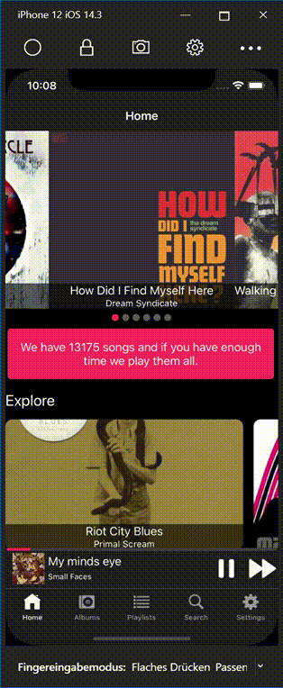
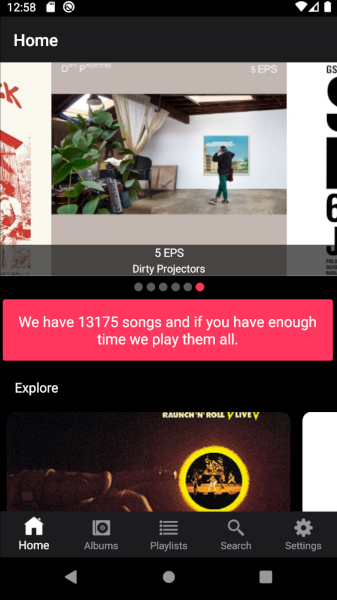
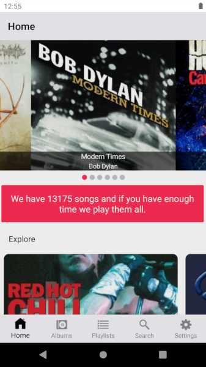
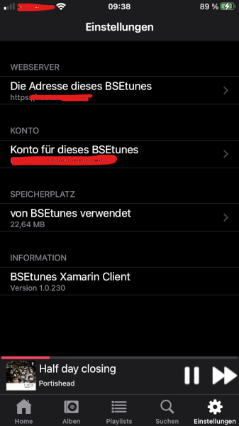

# BSE.Tunes.Xamarin
This is the Xamarin cross platform client of the BSEtunes system. With this client you can play single songs, whole albums, the content of your self created playlists and randomized, the whole content of your selected BSEtunes.

All the views support dark and light mode on

### IOS

 |  

and on
### Android

 | 

## Player

At the moment, the player is only available on ios. The app uses an adaption of the AudioToolbox. The reason therefore is, all the audio files on the BSEtunes server are protected. Because of that, the request headers have to contain security information. The audiosfilestream allows a separate file download with such http requests.

## Information

Due to copyright of the streamed music files, the load of our server and because of the, perhaps, limited bandwidth during the operation of the server, you need a user account for to connect to our server.

- You are not able to register yourself as a user via the app.
- A registration can only be done by the operator of the BSEtunes server

## Settings

All settings can be changed in the settings view.

## Tools

The App was created using the following tools
- : MVVM framework for building loosely coupled, modular, maintainable, and testable XAML applications.
- : a cross-platform 2D graphics API for .NET platforms based on Google's Skia Graphics Library.
- : Image loading, caching & transforming library for Xamarin
- : CardsView | CarouselView | CoverflowView | CubeView framework for Xamarin.Forms
